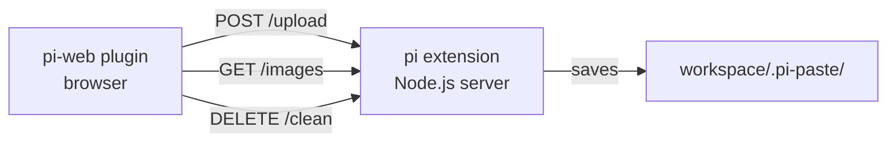

# @yieldcraft/screenshot-paste

> Paste screenshots into [pi-web](https://github.com/earendil-works/pi-web) chat — the agent sees them via `@file` references.

Published by [YieldCraft](https://yieldcraft.io).

---

## What it does

Press **⌘V** in the pi-web chat prompt. Your clipboard image is resized, saved to `workspace/.pi-paste/`, and referenced as `@.pi-paste/…`. Thumbnails appear above the editor and in a gallery panel. Click any thumbnail for a fullscreen lightbox with keyboard navigation.

## Prerequisites

- [pi-web](https://github.com/earendil-works/pi-web) — the web UI for pi
- [pi](https://github.com/earendil-works/pi-coding-agent) — the AI coding agent

## Architecture

The plugin has two parts that work together:



- **pi-web plugin** (`pi-web-plugin.js`) — runs in the browser, intercepts paste events, shows thumbnails
- **pi extension** (`.pi/extensions/screenshot-paste/index.ts`) — starts a local HTTP server on port 9876 when pi launches

The server handles uploads, serves images back, and cleans up on request. Both communicate over `localhost:9876`.

## Install

### pi extension (server)

```bash
pi install npm:@yieldcraft/screenshot-paste
```

This copies the extension into `~/.pi/agent/extensions/` and installs the plugin into `~/.pi-web/plugins/`. Restart pi — the server auto-starts on port 9876.

### Manual install (if `pi install` is unavailable)

```bash
npm install -g @yieldcraft/screenshot-paste

# Plugin
ln -sf $(node -e "console.log(require.resolve('@yieldcraft/screenshot-paste/..'))") ~/.pi-web/plugins/screenshot-paste

# Extension
cp -r $(node -e "console.log(require.resolve('@yieldcraft/screenshot-paste/.pi/extensions/screenshot-paste'))") ~/.pi/agent/extensions/
```

## Usage

| Action | Result |
|---|---|
| **⌘V** in chat prompt | Paste clipboard image, insert `@.pi-paste/…` at cursor |
| **⌘⇧V** | Programmatic paste via Actions menu |
| **× on thumbnail** | Remove image from staging (also removes `@file` from text) |
| **Panel → Paste tab** | Gallery of all workspace images |
| **Click thumbnail** | Fullscreen lightbox with ← → keyboard nav |
| **Panel → Clean** | Delete all `.pi-paste/` images from workspace |

## Features

- **Zero config** — server auto-starts with pi
- **Workspace-scoped** — images saved per workspace, not global `/tmp`
- **Auto gitignore** — `.pi-paste/` appended to `.gitignore` on first paste
- **Responsive gallery** — flex-wrap thumbnails adapt to panel width
- **Keyboard lightbox** — `←` `→` `Escape` (only active when open)
- **Access logging** — every request logged to console for debugging

## Server API

| Endpoint | Method | Body / Query | Response |
|---|---|---|---|
| `/health` | GET | — | `{ status: "ok" }` |
| `/upload` | POST | `{ base64, filename, workspace? }` | `{ path, relativePath, filename, size }` |
| `/images` | GET | `?workspace=` | `[{ filename, path, size }]` |
| `/images/:filename` | GET | `?workspace=` | raw image bytes |
| `/clean` | DELETE | `?workspace=` | `{ deleted: N }` |

## Development

```bash
npm run dev:link     # symlink plugin into ~/.pi-web/plugins/
npm run dev:unlink   # remove symlink
npm run server       # start HTTP server manually for debugging
```

## Private API Notice

This plugin accesses internal pi-web surfaces (prompt-editor shadow DOM, CodeMirror instance) marked as `@private-api`. These may break across pi-web upgrades.

## License

MIT © YieldCraft
