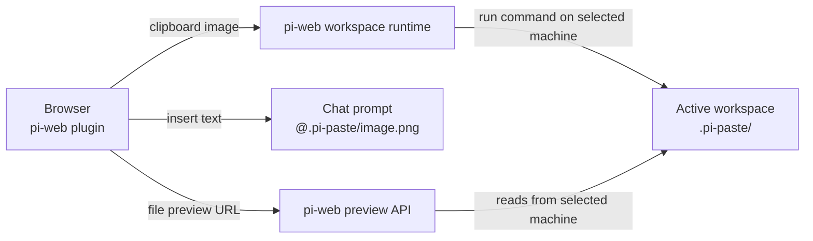

# @yieldcraft/screenshot-paste

> Paste screenshots into [pi-web](https://github.com/earendil-works/pi-web) chat — remote-safe, workspace-local, and visible to the agent via `@file` references.

Published by [YieldCraft](https://yieldcraft.io).

---

## What it does

Press **⌘V** in the pi-web chat prompt. The browser plugin resizes the clipboard image, writes it into the **active workspace** at `.pi-paste/`, and inserts an `@.pi-paste/…` reference at the cursor.

This works with both local and remote pi-web machines because the file is written through pi-web's workspace command runtime, not through browser `localhost`.

## Prerequisites

- [pi-web](https://github.com/earendil-works/pi-web) — the web UI for pi
- [pi](https://github.com/earendil-works/pi-coding-agent) — the AI coding agent

## Architecture



This package is a **pi-web plugin only**:

- `pi-web-plugin.js` intercepts paste events and manages thumbnails/gallery/lightbox.
- No local HTTP server is required.
- No fixed port is used.
- No absolute local paths are inserted.

## Install

```bash
pi install npm:@yieldcraft/screenshot-paste
```

Restart pi / pi-web, then hard-refresh the browser tab.

## Usage

| Action | Result |
|---|---|
| **⌘V** in chat prompt | Save clipboard image to active workspace and insert `@.pi-paste/…` |
| **⌘⇧V** | Programmatic paste via Actions menu |
| **× on thumbnail** | Remove image from staging, including the `@file` text |
| **Panel → Paste tab** | Session gallery for pasted images in the active workspace |
| **Click thumbnail** | Fullscreen lightbox with ← → keyboard nav |

## Features

- **Remote-safe** — writes to the selected pi-web machine/workspace, not browser `localhost`
- **Workspace-scoped** — images saved to `.pi-paste/` inside the active workspace
- **Agent-readable** — inserts relative `@.pi-paste/...` references
- **Auto gitignore** — `.pi-paste/` appended to `.gitignore` when the workspace is a git repo
- **Responsive thumbnails** — 128×128 letterboxed previews
- **Lightbox** — fullscreen preview with keyboard navigation

## Notes

The Paste panel shows images pasted during the current browser session. The files remain on disk in `.pi-paste/`, and the agent can read them via the inserted `@.pi-paste/...` references.

## Development

```bash
npm run dev:link     # symlink plugin into ~/.pi-web/plugins/
npm run dev:unlink   # remove symlink
```

## Private API Notice

This plugin accesses internal pi-web surfaces (prompt-editor shadow DOM and CodeMirror instance) marked as `@private-api`. These may break across pi-web upgrades.

## License

MIT © YieldCraft
