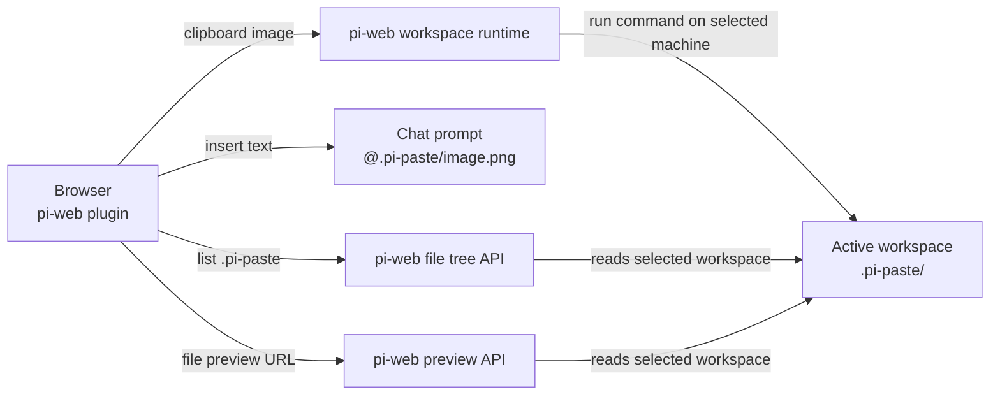

# @yieldcraft/screenshot-paste

> Paste screenshots into [pi-web](https://github.com/earendil-works/pi-web) chat — remote-safe, workspace-local, and visible to the agent via `@file` references.

Published by [YieldCraft](https://yieldcraft.io).

---

## What it does

Press **⌘V** in the pi-web chat prompt. The browser plugin resizes the clipboard image, writes it into the **active workspace** at `.pi-paste/`, and inserts an `@.pi-paste/…` reference at the cursor.

This works with both local and remote pi-web machines because the file is written through pi-web's selected workspace command runtime, not through browser `localhost`. The Paste panel also reads the selected workspace's `.pi-paste/` directory through pi-web's file tree API, so it can show screenshots that already exist on disk — not only images pasted during the current browser session.

## Prerequisites

- [pi-web](https://github.com/earendil-works/pi-web) — the web UI for pi
- [pi](https://github.com/earendil-works/pi-coding-agent) — the AI coding agent

## Architecture



This package is a **pi-web plugin only**:

- `pi-web-plugin.js` intercepts paste events and manages staging thumbnails, workspace gallery, chat-history thumbnails, cleaning, and lightbox.
- No local HTTP server is required.
- No fixed port is used.
- No absolute local paths are inserted.

## Install

```bash
pi install npm:@yieldcraft/screenshot-paste
```

Restart pi / pi-web, then hard-refresh the browser tab. When upgrading from an older build, do a full browser reload once so any old in-memory paste listener is removed.

## Usage

| Action | Result |
|---|---|
| **⌘V** in chat prompt | Save clipboard image to active workspace and insert `@.pi-paste/…` |
| **⌘⇧V** | Programmatic paste via Actions menu |
| **× on thumbnail** | Remove image from staging, including the `@file` text |
| **Panel → Paste tab** | Gallery of image files currently found in active workspace `.pi-paste/` |
| **Panel → Clean .pi-paste images** | Delete files inside the active workspace `.pi-paste/` folder |
| **Click thumbnail** | Fullscreen lightbox with ← → keyboard nav |

## Features

- **Remote-safe** — writes to the selected pi-web machine/workspace, not browser `localhost`
- **Workspace-scoped** — images saved to `.pi-paste/` inside the active workspace
- **Agent-readable** — inserts relative `@.pi-paste/...` references
- **Auto gitignore** — `.pi-paste/` appended to `.gitignore` when the workspace is a git repo
- **Workspace gallery** — Paste panel lists image files from `.pi-paste/` using pi-web's workspace file tree API
- **Responsive thumbnails** — staged, gallery, and chat-history previews use 128×128 letterboxed thumbnails
- **Chat-history thumbnails** — messages containing `@.pi-paste/...` get clean history thumbnail strips without staging remove buttons
- **Lightbox** — fullscreen preview with keyboard navigation
- **Workspace clean action** — optional panel button deletes files inside the active workspace `.pi-paste/`

## Gallery behavior

The Paste panel is workspace-backed:

1. It asks pi-web for the selected workspace's `.pi-paste/` directory with the workspace file tree API.
2. It filters image files (`.png`, `.jpg`, `.jpeg`, `.gif`, `.webp`).
3. It renders thumbnails through pi-web's file preview API for the selected machine/workspace.

That means images already visible in pi-web's Files panel under `.pi-paste/` should also appear in the Paste gallery after opening the Paste tab or hard-refreshing the browser.

The browser also keeps a short-lived cache of newly pasted images for immediate UI feedback, but the gallery is not limited to that cache.

## Agent usage

The files remain on disk in `.pi-paste/`, and the agent can read them via the inserted `@.pi-paste/...` references. If a user asks about a screenshot, the agent should read the referenced relative file path, for example:

```txt
read(".pi-paste/pi-paste-....png")
```

## Troubleshooting

| Symptom | Check |
|---|---|
| Paste panel is empty but images exist | Verify the active machine/workspace is the same one where `.pi-paste/` exists, then hard-refresh pi-web. |
| Files appear in Files panel but thumbnails do not load | Check pi-web's file preview API and that the paths are relative, e.g. `.pi-paste/file.png`. |
| Agent cannot see a screenshot | Ensure the chat contains `@.pi-paste/...`, not an absolute local path. |
| Paste fails on a remote machine | Ensure Node.js is installed on the selected remote machine; saving uses a workspace-local Node command. |
| Terminal tab shows preserved `Save screenshot ...` output | The plugin closes finished terminals best-effort, but pi-web currently preserves terminal command-run history. A future pi-web file-write API or ephemeral command-run option would avoid this entirely. |
| Old package inserts `/Users/...` paths | Upgrade to a remote-safe version (`>=0.2.2`) and full-reload the browser tab. |
| Old behavior comes back after update | Full-reload pi-web once. Newer versions register a global cleanup hook so soft reloads do not keep old paste listeners alive. |

## Development

```bash
npm run dev:link     # symlink plugin into ~/.pi-web/plugins/
npm run dev:unlink   # remove symlink
```

## Private API Notice

This plugin accesses internal pi-web surfaces (prompt-editor shadow DOM and CodeMirror instance) marked as `@private-api`. These may break across pi-web upgrades.

## License

MIT © YieldCraft
