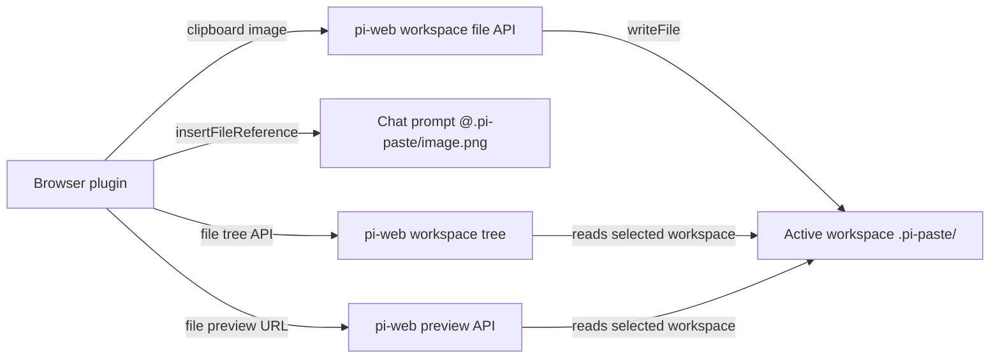

# @yieldcraft/screenshot-paste

> Paste screenshots into [pi-web](https://github.com/earendil-works/pi-web) chat using stable workspace file and attachment APIs.

Published by [YieldCraft](https://yieldcraft.io).

---

## What it does

Press **⌘V** in the pi-web chat prompt. The browser plugin resizes the clipboard image, writes it into the **active workspace** at `.pi-paste/`, and inserts an `@.pi-paste/…` reference at the cursor.

This version uses pi-web’s stable plugin APIs:

- `context.files.writeFile()` to save the image in the selected workspace
- `context.attachments.insertFileReference()` to insert `@.pi-paste/…` into the chat prompt
- `context.files.deleteFile()` to clean `.pi-paste/`
- `context.files.readFile()` / `context.files.writeFile()` to keep `.gitignore` up to date

The Paste panel reads the selected workspace’s `.pi-paste/` directory through pi-web’s file tree API, so it can show screenshots that already exist on disk — not only images pasted during the current browser session.

## Prerequisites

- [pi-web](https://github.com/earendil-works/pi-web) — the web UI for pi
- [pi](https://github.com/earendil-works/pi-coding-agent) — the AI coding agent

## Architecture



This package is a **pi-web plugin only**:

- `pi-web-plugin.js` intercepts paste events, saves images through pi-web's stable `files` API, and inserts references through the stable `attachments` API.
- No local HTTP server is required.
- No fixed port is used.
- No absolute local paths are inserted.
- No direct access to pi-web's private prompt-editor internals is required.

## Install

```bash
pi install npm:@yieldcraft/screenshot-paste
```

Restart pi / pi-web, then hard-refresh the browser tab. When upgrading from an older build, do a full browser reload once so any old in-memory paste listener is removed.

## Documentation

Start with [`docs/index.md`](docs/index.md) for the full public documentation set: installation, usage, architecture, troubleshooting, limitations, and release notes.

## Usage

| Action | Result |
|---|---|
| **⌘V** in chat prompt | Save clipboard image to active workspace and insert `@.pi-paste/…` |
| **⌘⇧V** | Programmatic paste via Actions menu |
| **Panel → Paste tab** | Gallery of image files currently found in active workspace `.pi-paste/` |
| **Panel → Clean .pi-paste images** | Delete files inside the active workspace `.pi-paste/` folder |
| **Click gallery thumbnail** | Fullscreen lightbox with ← → keyboard nav |

## Features

- **Stable pi-web APIs** — uses `files.writeFile`, `attachments.insertFileReference`, `files.deleteFile`, and `files.readFile`
- **Workspace-scoped** — images saved to `.pi-paste/` inside the active workspace
- **Agent-readable** — inserts relative `@.pi-paste/...` references
- **Auto gitignore** — `.pi-paste/` appended to `.gitignore` when the workspace is a git repo
- **Workspace gallery** — Paste panel lists image files from `.pi-paste/` using pi-web's workspace file tree API
- **Responsive thumbnails** — gallery previews use 128×128 letterboxed thumbnails
- **Lightbox** — fullscreen preview with keyboard navigation
- **Workspace clean action** — optional panel button deletes files inside the active workspace `.pi-paste/`

## Gallery behavior

The Paste panel is workspace-backed:

1. It asks pi-web for the selected workspace's `.pi-paste/` directory with the workspace file tree API.
2. It filters image files (`.png`, `.jpg`, `.jpeg`, `.gif`, `.webp`).
3. It renders thumbnails through pi-web's file preview API for the selected machine/workspace.

That means images already visible in pi-web's Files panel under `.pi-paste/` should also appear in the Paste gallery after opening the Paste tab or hard-refreshing the browser.

The browser also keeps a short-lived cache of newly pasted images for immediate UI feedback, but the gallery is not limited to that cache.

## Agent usage

The files remain on disk in `.pi-paste/`, and the agent can read them via the inserted `@.pi-paste/...` references. If a user asks about a screenshot, the agent should read the referenced relative file path, for example:

```txt
read(".pi-paste/pi-paste-....png")
```

## Troubleshooting

| Symptom | Check |
|---|---|
| Paste panel is empty but images exist | Verify the active machine/workspace is the same one where `.pi-paste/` exists, then hard-refresh pi-web. |
| Files appear in Files panel but thumbnails do not load | Check pi-web's file preview API and that the paths are relative, e.g. `.pi-paste/file.png`. |
| Agent cannot see a screenshot | Ensure the chat contains `@.pi-paste/...`, not an absolute local path. |
| Action ⌘⇧V says "Open the Paste panel once" | The panel/label renders must run at least once to capture the stable `files` API. Open the Paste panel, then retry. |
| Old package inserts `/Users/...` paths | Upgrade to a stable-API version (`>=0.3.0`) and full-reload the browser tab. |
| Old behavior comes back after update | Full-reload pi-web once. Newer versions register a global cleanup hook so soft reloads do not keep old paste listeners alive. |

## Development

```bash
npm run dev:link     # symlink plugin into ~/.pi-web/plugins/
npm run dev:unlink   # remove symlink
```

> ⚠️ **pi-web version requirement** — This plugin depends on the new pi-web plugin APIs (`files`, `attachments`, and `prompt`) introduced in the PR currently under review:
> `https://github.com/jmfederico/pi-web/pull/23`
>
> Until that PR is merged and released, this version of `screenshot-paste` only works against a pi-web build that includes those stable plugin APIs. If you install this plugin against an older pi-web release, `files.writeFile`, `attachments.insertFileReference`, and related methods will be missing and pasting will fail.

## License

MIT © YieldCraft
